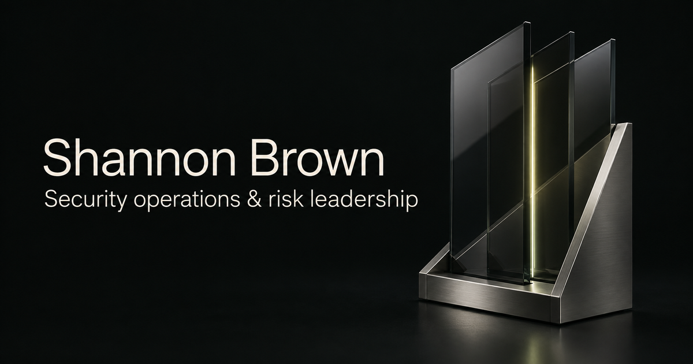

<a href="https://swb2019.github.io/shannon-brown-career/"></a>

# Shannon Brown

Security operations & risk leadership. A professional portfolio with original 3D, public-source analysis, exact experience chronology, and inspectable independent work.

[Live portfolio](https://swb2019.github.io/shannon-brown-career/) · [Hourglass case study](https://swb2019.github.io/shannon-brown-career/work/hourglass-command/) · [Notes](https://swb2019.github.io/shannon-brown-career/notes/) · [About](https://swb2019.github.io/shannon-brown-career/about/)

## Experience

The site connects professional evidence to the work: leadership of a 24-member GSOC, Harvard education, historical commercial results, a synthetic executive decision brief, and the Hourglass Command case study. Experience, analysis, and synthetic project material are clearly labeled.

## Design and behavior

“Signal to decision” is an original Three.js sculpture of three smoked-glass planes, machined metal, and a citron seam. It loads after the static content, aligns once, and rests. Readers can explore it using pointer or keyboard controls. Reduced motion, data saving, WebGL failure, and unavailable storage preserve a complete static reading experience.

All eight pages are static HTML. No backend, API key, analytics, form submission, or voice model is part of the portfolio. Hourglass is a separate application reached by an ordinary link.

## Develop and verify

Use Node.js 24 and the committed lockfile.

```sh
npm ci
npm run build
npm run check
npm run dev
```

`scripts/content.mjs` contains the two published briefs. `scripts/build.mjs` produces shared static pages and metadata. Styles and interaction modules remain small, directly editable files. The build recognizes the Sites checkout’s `dist/` output and this GitHub repository’s root output while preserving the public project base path.

The **Portfolio quality** workflow runs route and content checks, Chromium/Firefox/WebKit and mobile journeys, axe accessibility checks, failure-state tests, a 3D interaction test, and five mobile Lighthouse runs. Its artifacts record the actual tested revision and environment. Automated coverage is supplemented by manual keyboard, visual, and human-reader review; emulation is not a real-device or screen-reader certification.

## Source, scope, and maintenance

- [Asset provenance and licenses](ASSETS.md)
- [Maintenance, release checks, and rollback](MAINTENANCE.md)
- [Code license](LICENSE)
- [Public privacy notice](https://swb2019.github.io/shannon-brown-career/privacy/)

Developed through AI-assisted design and engineering. Professional facts are owner-supplied. No employer incident data, client systems, private strategy, or confidential evidence records belong in this repository.
